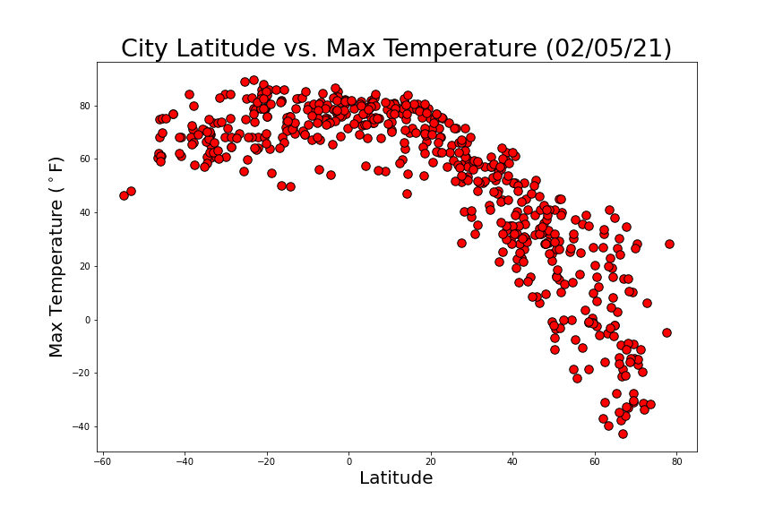
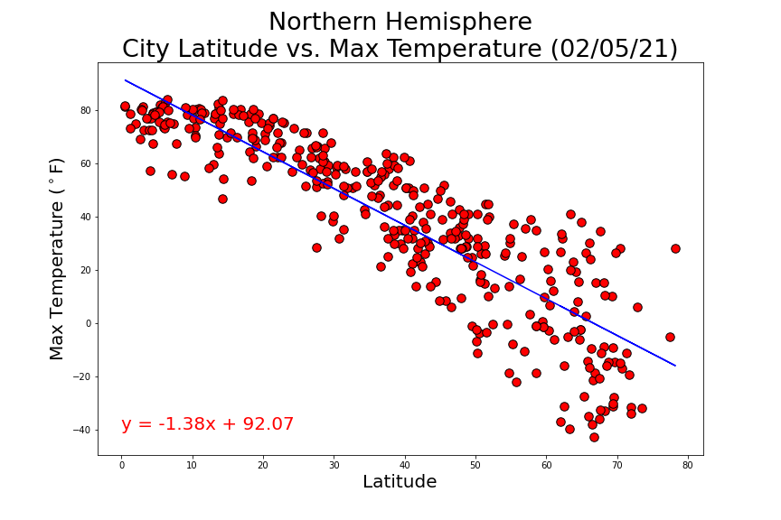
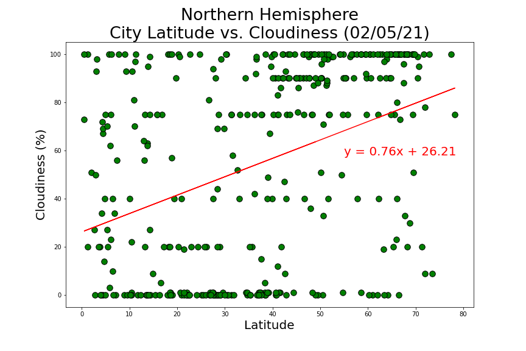
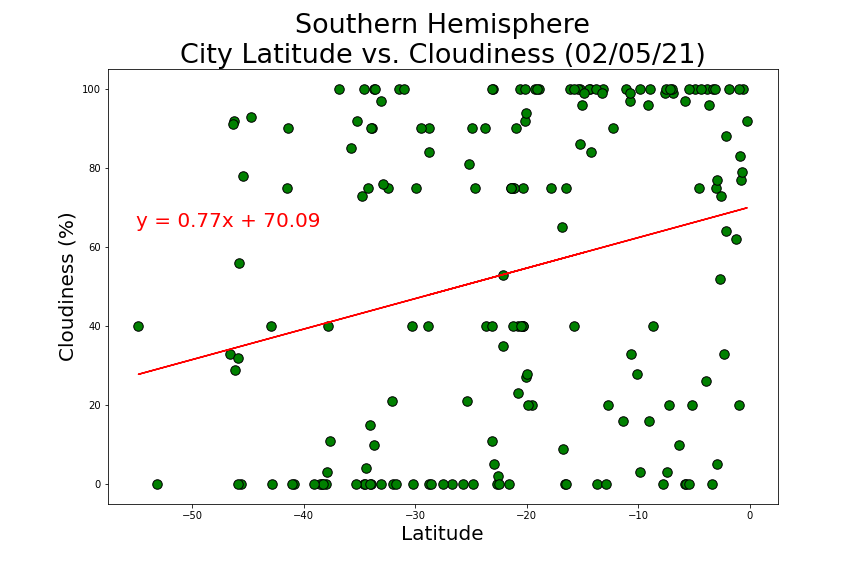
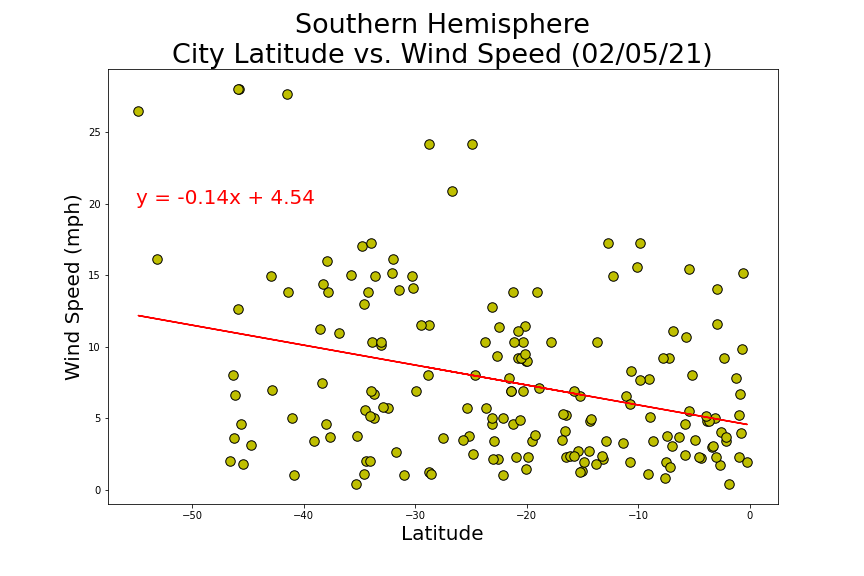

## Work left to do
- Humidity Kernel
- After each pair of plots, explain what the linear regression is modeling. For example, describe any relationships you notice and any other analysis you may have.
- For Part I, you must include a written description of three observable trends based on the data.
- For Part II, you must include a screenshot of the heatmap you create and include it in your submission.
- export all graphs and add them to README
- Finish README file

# Python API Homework - What's the Weather Like?

## Background

Whether financial, political, or social -- data's true power lies in its ability to answer questions definitively. So let's take what we've learned about Python requests, APIs, and JSON traversals to answer a fundamental question: "What's the weather like as we approach the equator?"

Now, we know what you may be thinking: _"Duh. It gets hotter..."_

But, if pressed, how would you **prove** it?

## Part I - WeatherPy

In this example, I creating a Python script to visualize the weather of 500+ cities across the world of varying distance from the equator.

The first requirement was to create a series of scatter plots to showcase the following relationships:

* Temperature (F) vs. Latitude

* Humidity (%) vs. Latitude

* Cloudiness (%) vs. Latitude

* Wind Speed (mph) vs. Latitude

After each plot I added an explaination as to what the code is doing as I analyzed the results.

The second requirement was to run linear regression on each relationship. This time, I separated the plots into Northern Hemisphere (greater than or equal to 0 degrees latitude) and Southern Hemisphere (less than 0 degrees latitude):

* Northern Hemisphere - Temperature (F) vs. Latitude

* Southern Hemisphere - Temperature (F) vs. Latitude

* Northern Hemisphere - Humidity (%) vs. Latitude

* Southern Hemisphere - Humidity (%) vs. Latitude

* Northern Hemisphere - Cloudiness (%) vs. Latitude

* Southern Hemisphere - Cloudiness (%) vs. Latitude

* Northern Hemisphere - Wind Speed (mph) vs. Latitude

* Southern Hemisphere - Wind Speed (mph) vs. Latitude

After each pair of plots, I added an explain as to what the linear regression is modeling.

### Part II - VacationPy

Now I used my skills in working with weather data to plan future vacations.

To complete this part of the assignment, I did the following:

* Created a heat map that displays the humidity for every city from Part I.

* Chose criteria to narrow down the DataFrame to find my ideal weather condition.

  * A max temperature lower than 85 degrees but higher than 70.

  * Humidity between 30-50%

  * Less than 20% chance of cloudiness.
  
 * Plotted the hotel over the previously created heatmap 
