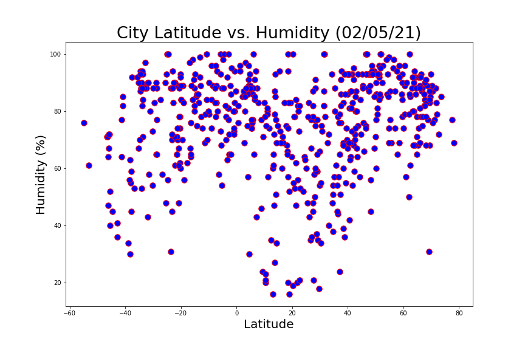
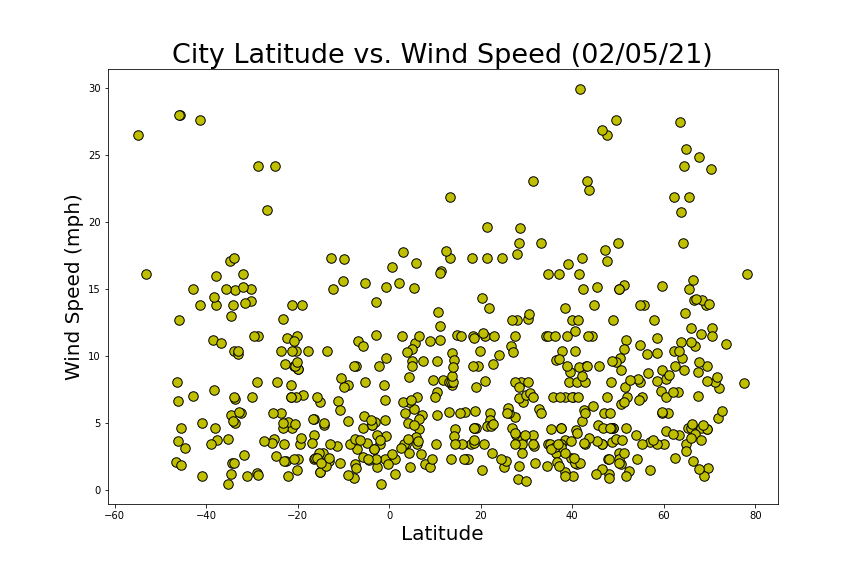
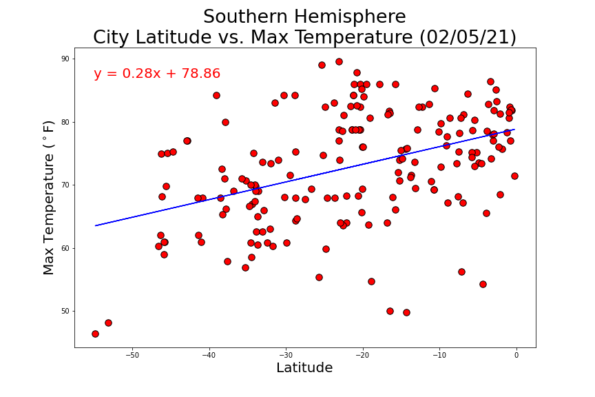
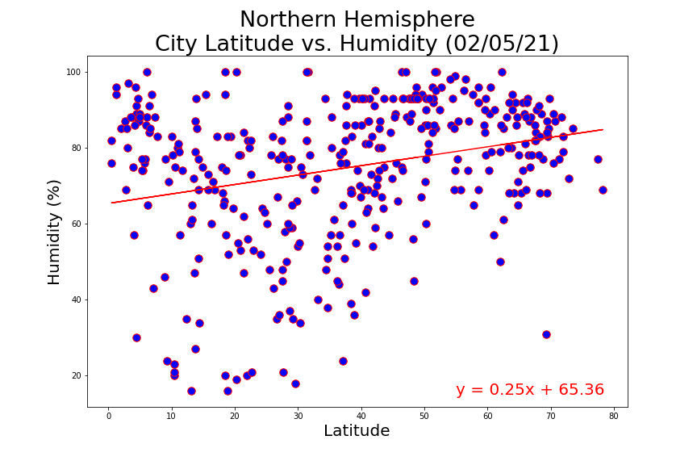
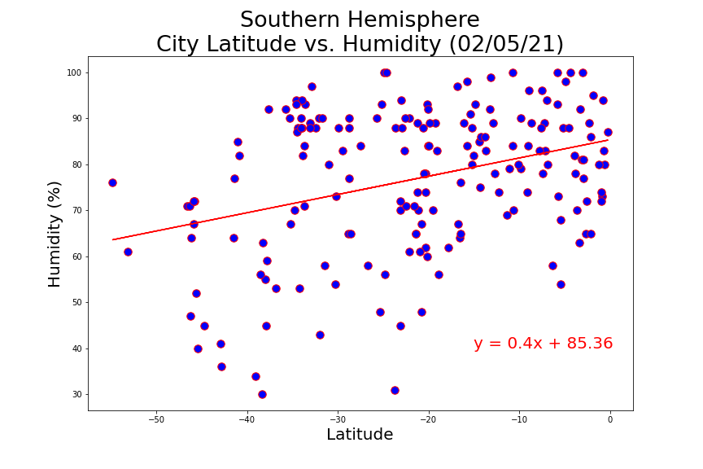
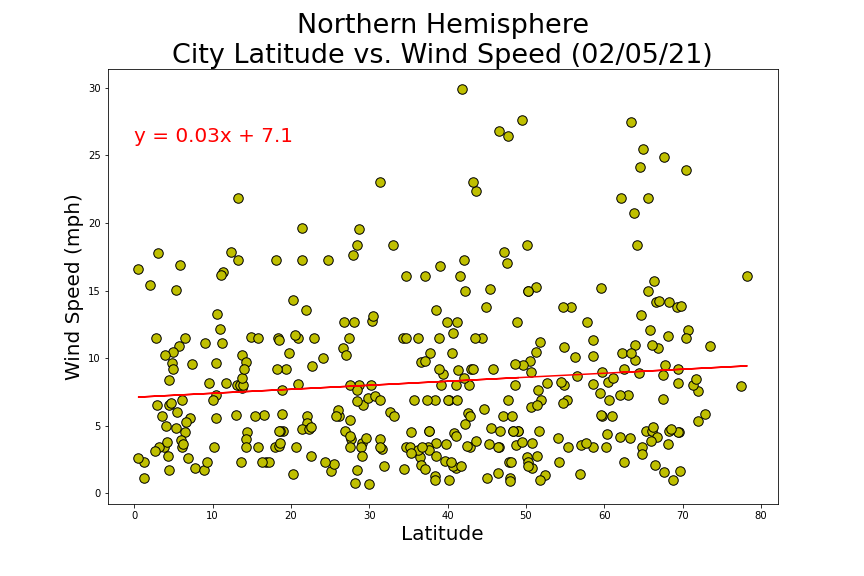
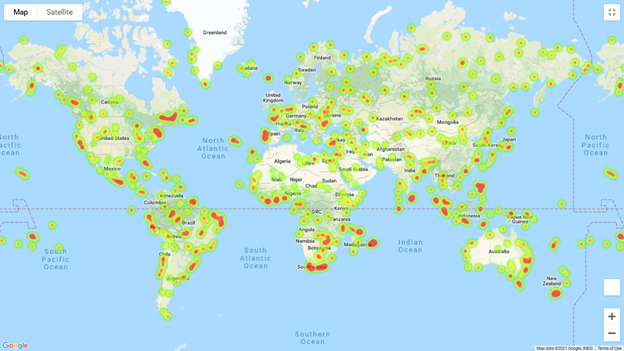
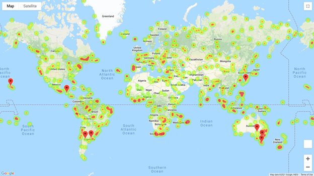

# Python API Homework - What's the Weather Like?

## Background

Whether financial, political, or social -- data's true power lies in its ability to answer questions definitively. So let's take what we've learned about Python requests, APIs, and JSON traversals to answer a fundamental question: "What's the weather like as we approach the equator?"

Now, we know what you may be thinking: _"Duh. It gets hotter..."_

But, if pressed, how would you **prove** it?

## Part I - WeatherPy

In this example, I creating a Python script to visualize the weather of 500+ cities across the world of varying distance from the equator.

The first requirement was to create a series of scatter plots to showcase the following relationships:

## * Temperature (F) vs. Latitude

### Analysis of Latitude vs. Max Temp Plot
- This graph shows the relationship between a city's latitude and their max temperature.
- The result shows what we all know and expect in that cities in the southern hemisphere and cities (both hemispheres) that are close to the equator have higher max temperatures than cities farther north of the equator.

## * Humidity (%) vs. Latitude

### Analysis of Latitude vs. Humidity Plot
- This graph shows the relationship between a city's latitude and their humidity levels.
- The analysis of this graph does not give us a great definitive correlation between a city's latitude and their humidity levels.
- When I ran this last data set, there was a small cluster of cities between 40-70 degrees latitude that had lower humidity rates, however this was not the case in some of my previous data sets.

## * Cloudiness (%) vs. Latitude

### Analysis of Latitude vs. Cloudiness
- This graph shows the relationship between a city's latitude and their percentage of cloudy days.
- The results of this graph do not show any correlation between a city's latitude and how many cloudy days they have.

## * Wind Speed (mph) vs. Latitude

### Analysis of Latitude vs. Wind Speed Plot
- This graph shows the relationship between a city's latitude and wind speeds.
- Looking at the graph, there does not seem to be a relationship between the city's latitude and wind speed.

The second requirement was to run linear regression on each relationship. This time, I separated the plots into Northern Hemisphere (greater than or equal to 0 degrees latitude) and Southern Hemisphere (less than 0 degrees latitude):

## * Northern Hemisphere - Temperature (F) vs. Latitude

## * Southern Hemisphere - Temperature (F) vs. Latitude

### Analysis of Latitude vs. Max Temperature broken up into the northern and southern hemispheres.
- The northern hemisphere shows a strong correlation between the latitude and max temperature. The visual data on the graph shows that the higher the latitude the lower the max temperatures are and the r-value of -.88 confirms the strong correlation between our data points.
- The southern hemisphere on the other hand does not show nearly as strong of a relationship between the data points. The points on the graph are pretty spread out and the r-value of .49 confirms that there is a weak correlation.

## * Northern Hemisphere - Humidity (%) vs. Latitude

## * Southern Hemisphere - Humidity (%) vs. Latitude

### Analysis of Latitude vs. Humidity broken up into the northern and southern hemispheres.
- The data in the northern hemisphere graphs does shows a weak correlation between the city's latitude and its humidity levels. The r-value of .32 supports that as well.
- The southern hemisphere has almost the same relationship ad r-value. 

## * Northern Hemisphere - Cloudiness (%) vs. Latitude

## * Southern Hemisphere - Cloudiness (%) vs. Latitude

### Analysis of Latitude vs. Percentage of Cloudy Days broken up into the northern and southern hemispheres.
- The graph for the northern hemisphere is showing a weak correlation between the city’s latitudes and they percentage of cloudy days they see. The r-value of .35 supports that this is a weak correlation between our data points.
- The graph for the southern hemisphere shows a weaker correlation between the data points. The r-value for this graph is .23 which means there is a weak, to no correlation.

## * Northern Hemisphere - Wind Speed (mph) vs. Latitude

## * Southern Hemisphere - Wind Speed (mph) vs. Latitude

### Analysis of Latitude vs. Wind Speed broken up into the northern and southern hemispheres.
- The graph for the northern hemisphere shows a weak correlation between a city’s latitude and their wind speeds. The r-vale for this data set is .35 which confirms the weak relationship between our data points.
-The graph for the also does not show much of a correlation between the latitude and the wind speed, however, is does appear to be stronger than the northern hemisphere. The r-value of -.28 confirms this relationship.

### Part II - VacationPy

Now I used my skills in working with weather data to plan future vacations.

To complete this part of the assignment, I did the following:

* Created a heat map that displays the humidity for every city from Part I.

* Chose criteria to narrow down the DataFrame to find my ideal weather condition. My conditions included:

  * A max temperature lower than 85 degrees but higher than 70.
  * Humidity between 30-50%
  * Less than 20% chance of cloudiness.
  
 * Lastly I plotted the hotels over the previously created humidity heatmap
 
